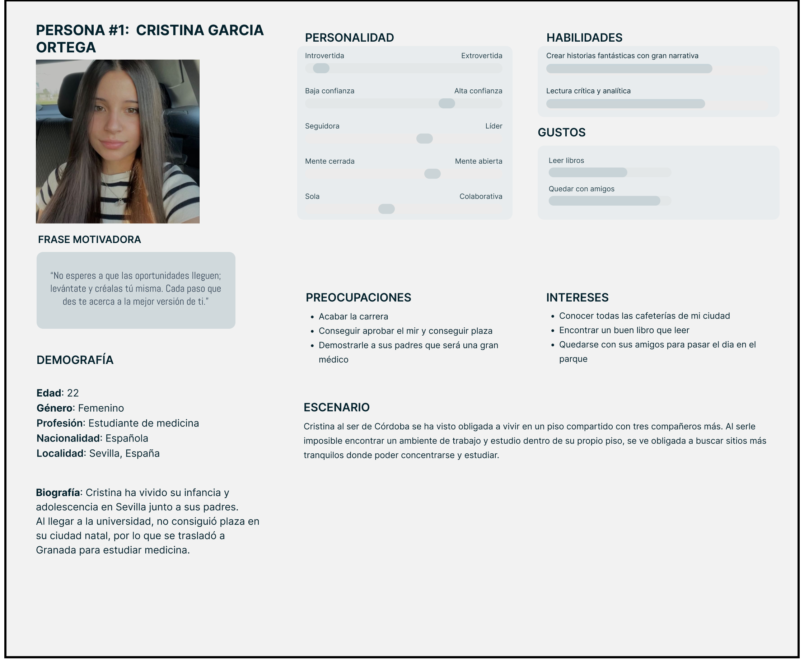
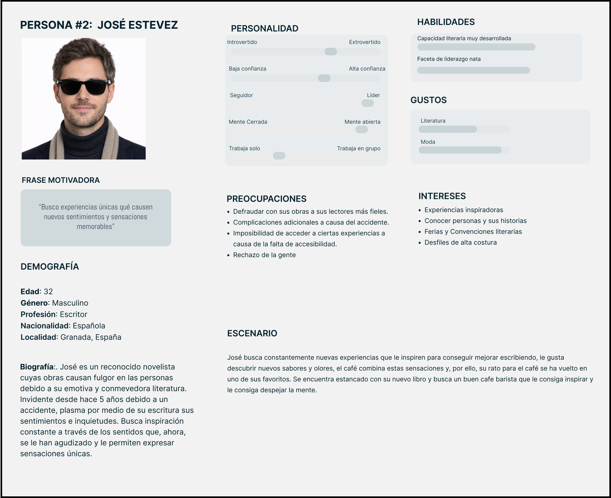
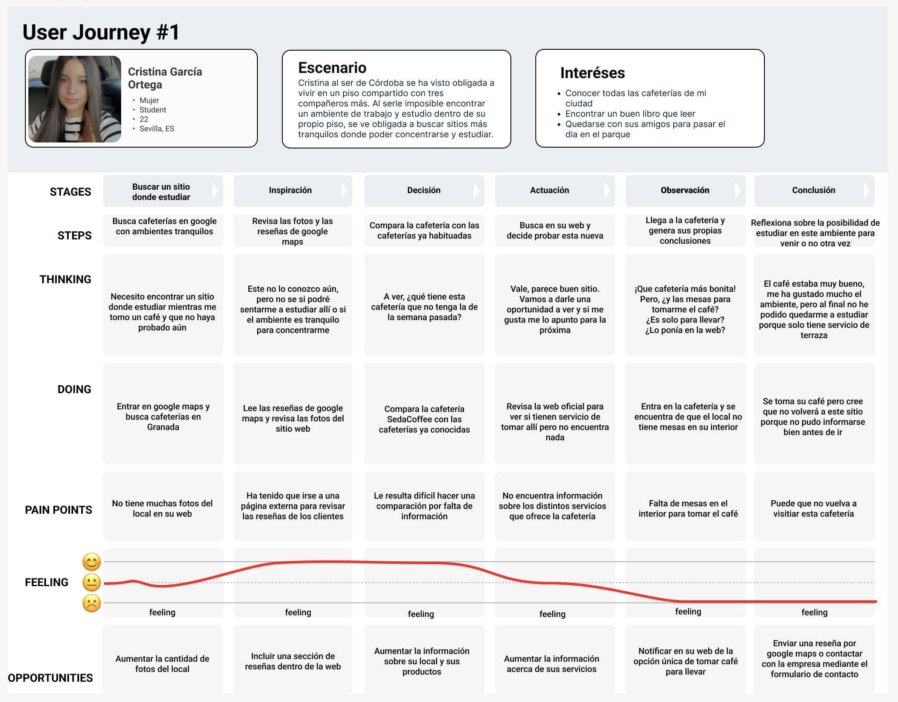

# DIU26
Prácticas Diseño Interfaces de Usuario (Tema: .... ) 

* [Guiones de prácticas](GuionesPracticas/)
* [Guía para crea tu Case Study](Guia_CaseStudy.md)
* Sala de la Fama [DIU Hall of fame](https://github.com/mgea/DIU/tree/master/hall_of_fame) donde se pueden encontrar Case Study destacados de otros años.

>>>Borrar esta linea cuando acabemos
>>>Enlace https://sedacoffee.com/

Actualizado: 14/01/2026

## Paso 0 My UX-Case Study
 
-----
Grupo: DIU2.UXplorers  Curso: 2025/26 

Nombre del Proyecto: 

>>> Decida el nombre corto de su propuesta en la práctica 2 

Descripción: 

>>> Describa la idea de su producto en la práctica 2 

Logotipo: 

>>> Si diseña un logotipo para su producto en la práctica 3 pongalo aqui, a un tamaño adecuado. Si diseña un slogan añadalo aquí

Miembros y nombre del equipo:
 * :bust_in_silhouette:  Mateo Domínguez
 * :bust_in_silhouette:  Aitor Fernández

----- 

 

# Proceso de Diseño 

 

## Paso 1. UX User & Desk Research & Analisis 

### 1.a User Reseach Plan
 
-----

Somos un grupo de programadores con la idea de analizar los diferentes tipos de actividades que lleva a cabo la empresa "Seda Coffee", como puede
ser la venta de café de especialidad y servicio de catering. Es importante recalcar la experiencia que ofrece esta empresa, por lo que no debemos
centrarnos únicamente en la venta de café sino también en la experiencia que involucra toda su elaboración.

Nos centraremos en analizar la interfaz así como la usabilidad de la web, con el fin de aumentar la actividad y mejorar la experiencia del usuario.

Contamos con experiencia previa en el desarrollo de plataformas web para empresas del sector, lo que nos permite abordar este análisis con una perspectiva técnica y orientada al usuario.

Como observadores, contemplamos un aumento en la demanda los servicios de baristas y del consumo de café de especialidad.
 

Para llevar a cabo esta investigación emplearemos dos métodos principales. En primer lugar, realizaremos un análisis competitivo de webs similares 
en el sector del café de especialidad, con el objetivo de identificar oportunidades de mejora para la plataforma de Seda Coffee. 
En segundo lugar, llevaremos a cabo estudios de observación directa en el local, donde estudiaremos el comportamiento de los clientes durante su visita, 
prestando atención sobre todo a cómo interactúan con el espacio o con el servicio.

 

Analizado el público objetivo de establecimientos similares vemos que hay un patrón que se repite en la mayoría de los usuarios, la mayoría de los
usuarios se clasifican en:
 * Clientes de edad avanzada acostumbrada a beber café de una manera más tradicional.
 * Clientes adultos que buscan nuevas experiencias con respecto al café.
 * Joven acostumbrado al café tradicional que prueba por primera vez café de especialidad.
 * Empresas que buscan contentar clientes con un buen café de especialidad.
 * Futuros matrimonios que buscan ofrecer a sus invitados una experiencia única con café de especialidad

Como usuarios podemos realizar varias operaciones a través de la web como puede ser, compra de café de especialidad y la reserva de servicio
de catering y en el establecimiento, disfrutar del servicio de los baristas mientras preparan nuestro café.

 

La selección de usuarios se realizará mediante visitas presenciales al establecimiento de Seda Coffee en Granada. Durante estas visitas observaremos a 
los clientes, sin intervenir en su experiencia, lo que nos permitirá obtener datos sobre sus comportamientos y necesidades reales. 
Buscaremos cubrir los distintos perfiles identificados anteriormente: desde clientes de mayor edad hasta jóvenes que se acercan por primera vez al café de especialidad, 
pasando por representantes de empresas o parejas interesadas en el servicio de catering.

Para concluir, profundizaremos las necesidades y comportamiento de los usuarios, mencionados anteriormente, ofreciendo mejoras en el diseño
y en las estrategias de marketing de la plataforma. Realizaremos varios estudios para evaluar a nivel competitivo la situación de la empresa para
maximizar sus beneficios.

### 1.b Competitive Analysis
 
-----
Para poner en perspectiva la empresa hemos seleccionado tres competidores de características muy similares que nos permitirán saber que
ventajas y debilidades tiene nuestra empresa con respecto al resto de empresas en el mismo entorno. Breve descripción de los competidores:
 * Cafe 1931: Café barista con un toque tropical cuyo aspecto que destaca con respecto al resto, vende un producto muy similar al de nuestra empresa, carece de sitio para tomar el café.
 * Despiertoo: Café barista con muy buena ubicación, en el centro de Granada, muy próximo a la catedral lo que podría suponer una ventaja.
 * La finca roaster: Otra opción similar que, además de ofrecer la experiencia de un buen café de especialidad, también ofrece varias opciones llamativas de bollería, que puede ser un factor a tener en cuenta.

[Competitive Analysis](./P1/Competitor_Analysis.pdf)
>>> Describe brevemente características de las aplicaciones que tiene asignadas tu grupo. Decidete por una y explica por qué se ha seleccionado. Borra esta línea cuando lo tengas. 

### 1.c Personas
 
-----

>>> Junto con la captura de pantalla de la ficha de la persona, haz una breve descripción de la misma. Recuerda que son dos. Los recursos de imagen deberán estar dentro de la carpeta P1/ Cuando termines, borra esta línea.  

### 1.d User Journey Map
 
----
Journey Map de Cristina:

Para Cristina, la experiencia en esta cafetería no ha sido la que esperaba. Ella buscaba un sitio con mesas en su interior para tomar un café mientras estudiaba y se ha encontrado que no había información al respecto en la web y cuando ha llegado al local no tenía y era solo café para llevar.
>>> Describe el porqué de las dos experiencias de usuario contadas en el journey map. Por ejemplo, reflexiona si te parece que son habituales. Enlaza con los recursos journey que están en la carpeta P1/. Borra esta linea del template cuando termines.  

### 1.e Usability Review
 
----

>>>  El objetivo es revisar la usabilidad del competidor seleccionado. Usamos un checklist de verificación. Tras usarlo, subelo a la carpeta P1/ Ofrece aquí un parrafo para:
>>> - Enlace al documento:  (xls/pdf) 
>>> - URL y Valoración numérica obtenida: 
>>> - Comentario sobre la revisión:  (puntos fuertes y débiles detectados)

 

## Paso 2. UX Design  

>>> Cualquier título puede ser adaptado. Recuerda borrar estos comentarios del template en tu documento

### 2.a Reframing / IDEACION: Feedback Capture Grid / EMpathy map 
 
----

>>> Comenta con un diagrama los aspectos más destacados a modo de conclusion de la práctica anterior. De qué carece la competencia?? Tu diagrama puede ser una figura subida a la carpeta P2/

 Interesante | Críticas     
| ------------- | -------
  Preguntas | Nuevas ideas
  
    
>>> Explica el Problema y plantea una hipótesis. Es decir, explica aquí qué 
>>> se plantea como "propuesta de valor" para un nuevo diseño de aplicación propio

### 2.b ScopeCanvas

----

>>> Propuesta de valor, pero ahora en vez de un texto es un ScopeCanvas que has subido a P2/ y enlazado desde aqui. Tambien vale una imagen miniatura del recurso.
>>> No olvides que tu propuesta ya tiene un nombre corto y puedes actualizar la cabecera de este archivo

### 2.b User Flow (task) analysis 
 
-----

>>> Definir "User Map" y "Task Flow" ... enlazar desde P2/ y describir brevemente

### 2.c IA: Sitemap + Labelling 
 
----

>>> Identificar términos para diálogo con usuario (evita el spanglish) y la arquitectura de la información. Es muy apropiado un diagrama tipo sitemap y una tabla que se ampliaría para llevar asociado la columna iconos (tanto para la web como para una app). 

Término | Significado     
| ------------- | -------
  Login  | acceder a plataforma

### 2.d Wireframes
 
-----

>>> Plantear el diseño del layout para Web/movil (organización y simulación). Describa la herramienta usada 

 

## Paso 3. Mi UX-Case Study (diseño)

>>> Cualquier título puede ser adaptado. Recuerda borrar estos comentarios del template en tu documento

### 3.a Moodboard

-----

>>> Diseño visual con una guía de estilos visual (moodboard) 
>>> Incluir Logotipo. Todos los recursos estarán subidos a la carpeta P3/
>>> Explique aqui la/s herramienta/s utilizada/s y el por qué de la resolución empleada. Reflexione ¿Se puede usar esta imagen como cabecera de Instagram, por ejemplo, o se necesitan otras?

### 3.b Landing Page
 
----

>>> Plantear el Landing Page del producto. Aplica estilos definidos en el moodboard

### 3.c Guidelines
 
----

>>> Estudio de Guidelines y explicación de los Patrones IU a usar 
>>> Es decir, tras documentarse, muestre las deciones tomadas sobre Patrones IU a usar para la fase siguiente de prototipado. 

### 3.d Mockup
 
----

>>> Consiste en tener un Layout en acción. Un Mockup es un prototipo HTML que permite simular tareas con estilo de IU seleccionado. Muy útil para compartir con stakeholders

 

## Paso 4. Pruebas de Evaluación 

### 4.a Reclutamiento de usuarios 

-----

>>> Breve descripción del caso asignado (llamado Caso-B) con enlace al repositorio Github
>>> Tabla y asignación de personas ficticias (o reales) a las pruebas. Exprese las ideas de posibles situaciones conflictivas de esa persona en las propuestas evaluadas. Mínimo 4 usuarios: asigne 2 al Caso A y 2 al caso B.

| Usuarios | Sexo/Edad     | Ocupación   |  Exp.TIC    | Personalidad | Plataforma | Caso
| ------------- | -------- | ----------- | ----------- | -----------  | ---------- | ----
| User1's name  | H / 18   | Estudiante  | Media       | Introvertido | Web.       | A 
| User2's name  | H / 18   | Estudiante  | Media       | Timido       | Web        | A 
| User3's name  | M / 35   | Abogado     | Baja        | Emocional    | móvil      | B 
| User4's name  | H / 18   | Estudiante  | Media       | Racional     | Web        | B 

### 4.b Diseño de las pruebas 
 
-----

>>> Planifique qué pruebas se van a desarrollar. ¿En qué consisten? ¿Se hará uso del checklist de la P1?

### 4.c Cuestionario SUS
 
----

>>> Como uno de los test para la prueba A/B testing, usaremos el **Cuestionario SUS** que permite valorar la satisfacción de cada usuario con el diseño utilizado (casos A o B). Para calcular la valoración numérica y la etiqueta linguistica resultante usamos la [hoja de cálculo](https://github.com/mgea/DIU19/blob/master/Cuestionario%20SUS%20DIU.xlsx). Previamente conozca en qué consiste la escala SUS y cómo se interpretan sus resultados
http://usabilitygeek.com/how-to-use-the-system-usability-scale-sus-to-evaluate-the-usability-of-your-website/)
Para más información, consultar aquí sobre la [metodología SUS](https://cui.unige.ch/isi/icle-wiki/_media/ipm:test-suschapt.pdf)
>>> Adjuntar en la carpeta P4/ el excel resultante y describa aquí la valoración personal de los resultados 

### 4.d A/B Testing
 
-----

>>> Los resultados de un A/B testing con 3 pruebas y 2 casos o alternativas daría como resultado una tabla de 3 filas y 2 columnas, además de un resultado agregado global. Especifique con claridad el resultado: qué caso es más usable, A o B?

### 4.e Aplicación del método Eye Tracking 

----

>>> Indica cómo se diseña el experimento y se reclutan los usuarios. Explica la herramienta / uso de gazerecorder.com u otra similar. Aplíquese únicamente al caso B.

  
>>> Cambiar esta img por una de vuestro experimento. El recurso deberá estar subido a la carpeta P4/  

>>> gazerecorder en versión de pruebas puede estar limitada a 3 usuarios para generar mapa de calor (crédito > 0 para que funcione) 

### 4.f Usability Report de B
 
-----

>>> Añadir report de usabilidad para práctica B (la de los compañeros) aportando resultados y valoración de cada debilidad de usabilidad. 
>>> Enlazar aqui con el archivo subido a P4/ que indica qué equipo evalua a qué otro equipo.

>>> Complementad el Case Study en su Paso 4 con una Valoración personal del equipo sobre esta tarea

 

## Paso 5. Exportación y Documentación 

### 5.a Exportación a HTML/React
 
----

>>> Breve descripción de esta tarea. Las evidencias de este paso quedan subidas a P5/

### 5.b Documentación con Storybook

----

>>> Breve descripción de esta tarea. Las evidencias de este paso quedan subidas a P5/

 

## Conclusiones finales & Valoración de las prácticas

>>> Opinión FINAL del proceso de desarrollo de diseño siguiendo metodología UX y valoración (positiva /negativa) de los resultados obtenidos. ¿Qué se puede mejorar? Recuerda que este tipo de texto se debe eliminar del template que se os proporciona 

